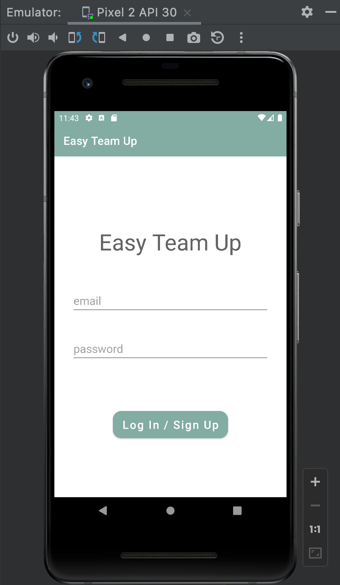
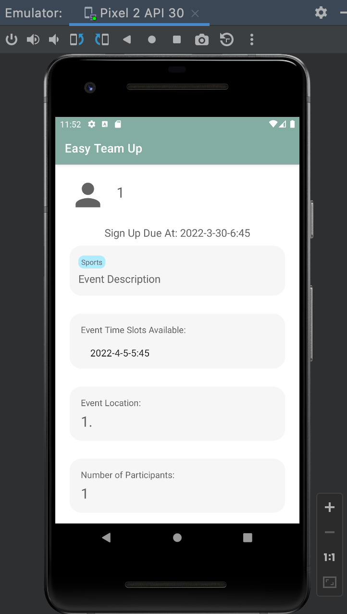
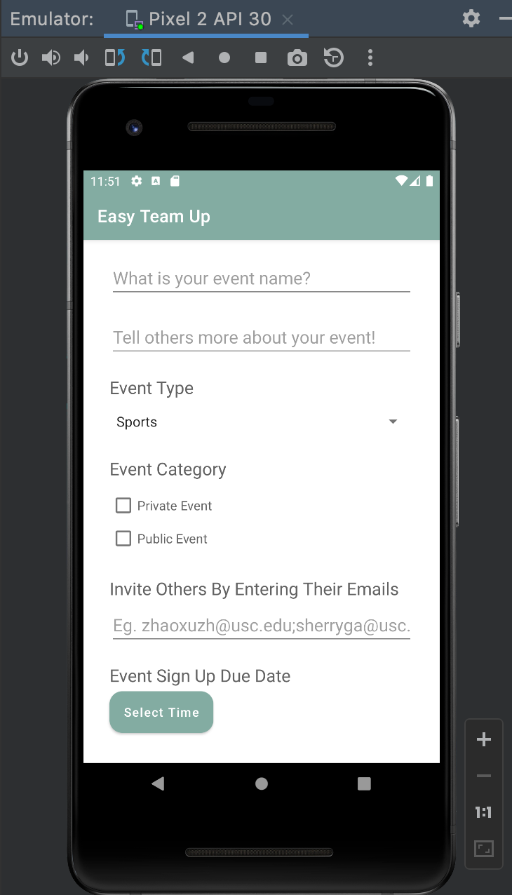
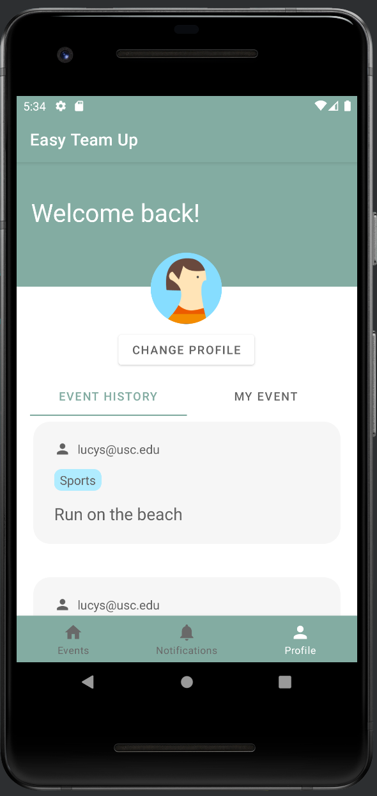
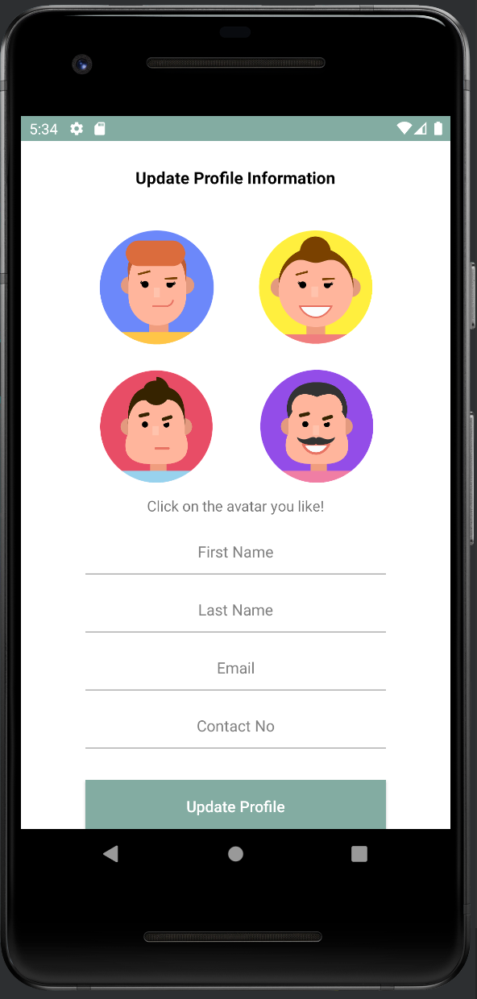
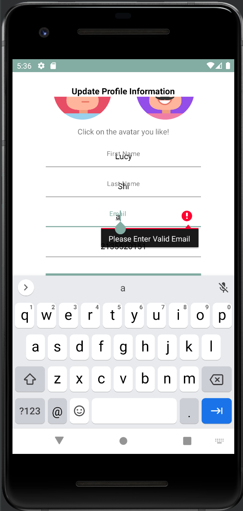
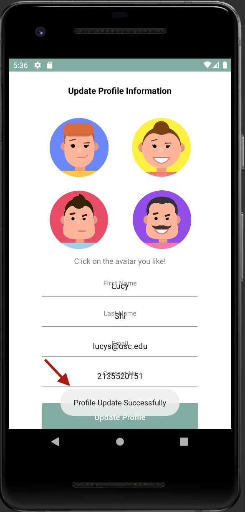

# EasyTeamUp
## 1. Log in / Sign up

On the log in page, please put in your email and a password to get access to the home page.

1. If you already have an account with us, you could directly log into your account. If not, we will automatically sign you up.
2. If your email/password does not match, you are not able to log into your account.

## 2. Events

The first page you will see is a list of active events for you to explore. Please scroll up and down to view more. You can see the details of the event, including event location, type, duration, description, etc.

The Defult view is the list view. You can switch between the list/map view by clicking on the top-left button.

By clicking on each event, you can view the details. If you are on map view, please click on the marker which has the event name on it. It will also direct you to the event detail page.

To go back, please use the *go back* button from the emulator, just as what we normally do with android phones.

By clicking on the green *add* button, you can now create your own event.

1. If you don't fill in everything, you will see a warning and your event will not be created.
2. Please invite others by entering their email address with semicolon as the seperator.
3. Please enter a valid address, otherwise you will see a warning and your event will not be created.

## 3. Notifications
On the notification page you can view the notifications and invitations you received.

## 4. Profile

The profile page is the portal for you to view your own events and change your profile. There are two tabs that you can switch between: the *Event History* tab that shows the events that you attend, and the *My Event* tab where you can view the posts that you created. 

Note that the profile page only shows an overview of your events. To navigate to any of them, just click the event to view the details. You can also edit (if you are the event host) and withdraw from (if you are a participant) the event through this portal.
 
In addition, by clicking "change profile", you will be taken to the change profile page as below.

Here, you can choose the avatar you like and edit your personal information.

### Updates after Project 2.4
- When the user changes his/her profile information (eg. email address), verify that this is valid information to avoid messing up with our database.

- Filter events by categories, such that a event not posted by the user should not appear on the “My Event” page.

- Debug the instability of toast on the “Change Profile” page (an issue found in 2.4, that toast sometimes did not appear on some devices).

- Users will get a snack-bar notifcation if and only if they just log in. The message will show how many new invitations and notifcations since users check out their notifcation page last time. 
