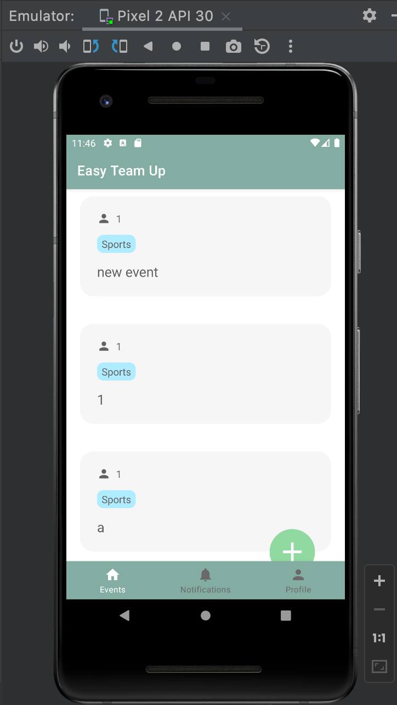

# EasyTeamUp
## Usage
### 1. Log in / Sign up

On the log in page, please put in your email and a password to get access to the main menu.

### 2. Events

The first page you will see is a list of active events for you to explore. Please drag up and down to view more. You can see the event name, the owner of the event, their avatar, and event category.

By clicking on each event, you can view the details.

To go back, please use the *go back* button from the emulator, just as what we normally do with android phones.

By clicking on the green *add* button, you can now create your own event.

### 3. Notifications
Similarly, on the notification page you can view the notifications / invitations you received.

### 4. Profile
You can switch between event history and my events tabs to view events. Through "change profile" you can make changes to your avatar and personal info.